# 网络空间安全概论：图像加密算法研究与改进

## 仓库目录结构

```
.
├───algorithms/     四种图像加密算法目录		
	|
	├───BaseCrypto.py               四个算法的公共接口
	|
	├───ArnoldCatCrypto.py          基于Arnold-Cat混沌系统的图像加密算法
	|
	├───LogisticCrypto.py           基于Logistic混沌系统的图像加密算法
	|	
	├───LogisticKeyMixingCrypto.py  基于密钥混合的Logistic图像加密算法
	|
	├───RSACrypto.py                基于图像分块的RSA图像加密算法
	|
	└───__init__.py                 python软件包初始化文件
	
├───assets/                 测试图片目录
│   
├───demo_files/		    代码说明文档用到的演示图片目录
|  
├───.gitignore		    git忽略规则文件
|   
├───README.md		    代码说明文档
| 
├───requirements.txt        软件包依赖
| 
├───U202215566_刘师言_图像加密算法研究与改进/		课程报告
|   
├───demo.ipynb		    代码演示程序
|
└───utils.py		    工具类
```

## 运行环境

Python 3.9.12

## requirements

```
numpy==1.26.4
opencv-python==4.10.0.84
tqdm==4.66.2
Pillow==9.4.0
pycryptodome==3.20.0
matplotlib==3.8.3
jupyter==1.1.1
```


---

## `demo.ipynb`运行演示

```python
from algorithms import RSACrypto, ArnoldCatCrypto, LogisticCrypto, LogisticKeyMixingCrypto
from utils import *
%matplotlib inline
```

## 加载测试图片


```python
test1 = "assets/hust.jpg"
test2 = "assets/leno.bmp"
img1 = cv2.imread(test1)   # 彩色图片
img2 = cv2.imread(test2)   # leno 人像图片
imshow(img1, img2, titles=["test1", "test2"])
```


​    


---
## RSA 分块算法

### RSA: 初始化


```python
# RSA 初始化
public_key, private_key = RSACrypto.generate_keypair(2048)   # 生成长度为 2048 的 RSA 密钥对
rsa = RSACrypto(public_key)    # 使用 RSA 公钥对算法进行初始化
```

### RSA: 图像加密


```python
# RSA 图像加密
# 由于 RSA 算法解密过程较慢，这里使用较小的测试图片1来测试
test1_rsa_encrypted = rsa.encrypt(img1)
# imshow(test1_rsa_encrypted)
```


      0%|          | 0/919 [00:00<?, ?it/s]


    Encryption time: 0.44s


### RSA: 图像解密 (正确)


```python
# RSA 图像解密 (密钥正确时)
test1_rsa_decrypted = rsa.decrypt(test1_rsa_encrypted, key=private_key) # 该过程较慢，是由于 RSA 算法本身计算的开销非常大
```


      0%|          | 0/923 [00:00<?, ?it/s]


    Decryption time: 2.48s


```python
imshow(img1, test1_rsa_encrypted, test1_rsa_decrypted, titles=["test1", "test1_rsa_encrypted", "test1_rsa_decrypted"])
```


​    
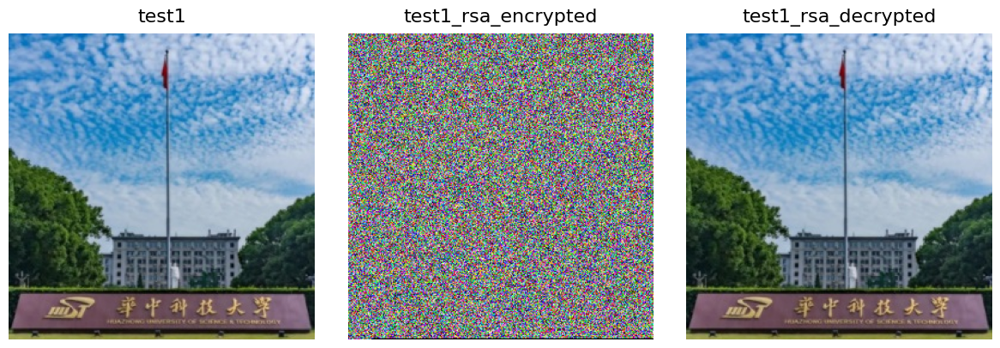
​    


### RSA : 图像解密 (错误)


```python
# RSA 图像解密 (密钥错误时)
_, private_key_wrong = RSACrypto.generate_keypair(2048)   # 随机产生一个错误的密钥
test1_rsa_decrypted_wrong = rsa.decrypt(test1_rsa_encrypted, key=private_key_wrong) # 使用错误的私钥进行解密 
```


      0%|          | 0/923 [00:00<?, ?it/s]


    Decryption time: 2.43s


```python
imshow(img1, test1_rsa_encrypted, test1_rsa_decrypted_wrong, titles=["test1", "test1_rsa_encrypted", "test1_rsa_decrypted_wrong"])
```


​    

​    


### RSA: 评价指标

#### Intensity Histogram


```python
# 测试图1 使用 RSA 加密前后的 Intensity Histogram
draw_intensity_histogram(img1, test1_rsa_encrypted)
```


​    
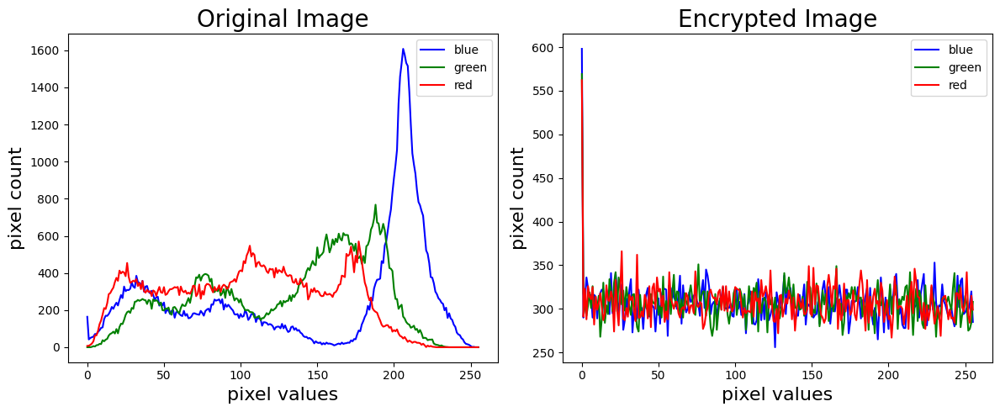
​    


#### Adjacent Pixel Auto-Correlation


```python
# 测试图1 使用 RSA 加密前后的 Adjacent Pixel Auto-Correlation
draw_adjacent_pixel_auto_correlation(img1, test1_rsa_decrypted)
```


​    
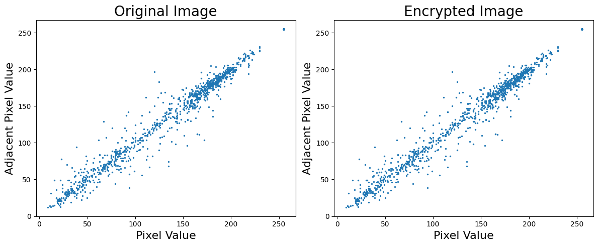
​    


---
## ArnoldCat 算法

### ArnoldCat : 初始化


```python
# Arnold 初始化
arnold_key = (3, 4, 20)    # (a, b, num_iter)
arnold = ArnoldCatCrypto(arnold_key)
```

### ArnoldCat : 图像加密


```python
# Arnold 图像加密
test1_arnold_encrypted = arnold.encrypt(img1)
test2_arnold_encrypted = arnold.encrypt(img2)
```


      0%|          | 0/20 [00:00<?, ?it/s]


    Encryption time: 0.05s


      0%|          | 0/20 [00:00<?, ?it/s]


    Encryption time: 0.19s


### ArnoldCat : 图像解密 (正确)


```python
# Arnold 图像解密 (密钥正确时) 
test1_arnold_decrypted = arnold.decrypt(test1_arnold_encrypted, arnold_key) # 该过程相比 RSA 算法快了非常多
test2_arnold_decrypted = arnold.decrypt(test2_arnold_encrypted, arnold_key)
```


      0%|          | 0/20 [00:00<?, ?it/s]


    Encryption time: 0.04s


      0%|          | 0/20 [00:00<?, ?it/s]


    Encryption time: 0.18s


```python
imshow(img1, test1_arnold_encrypted, test1_arnold_decrypted, titles=["test1", "test1_arnold_encrypted", "test1_arnold_decrypted"])
imshow(img2, test2_arnold_encrypted, test2_arnold_decrypted, titles=["test2", "test2_arnold_encrypted", "test2_arnold_decrypted"])
```


​    

​    


    


### ArnoldCat : 图像解密 (错误)


```python
# Arnold 图像解密 (密钥错误时)
arnold_key_wrong = (4, 3, 20)   # 一个错误的密钥，正确密钥应为 (3, 4, 20)
test1_arnold_decrypted_wrong = arnold.decrypt(test1_arnold_decrypted, arnold_key_wrong)
test2_arnold_decrypted_wrong = arnold.decrypt(test2_arnold_decrypted, arnold_key_wrong)
```


      0%|          | 0/20 [00:00<?, ?it/s]


    Encryption time: 0.04s


      0%|          | 0/20 [00:00<?, ?it/s]


    Encryption time: 0.19s


```python
imshow(img1, test1_arnold_encrypted, test1_arnold_decrypted_wrong, titles=["test1", "test1_arnold_encrypted", "test1_arnold_decrypted_wrong"])
imshow(img2, test2_arnold_encrypted, test2_arnold_decrypted_wrong, titles=["test2", "test2_arnold_encrypted", "test2_arnold_decrypted_wrong"])
```


​    

​    


    


### ArnoldCat: 评价指标

#### Intensity Histogram


```python
# 测试图1 使用 ArnoldCat 加密前后的 Intensity Histogram
draw_intensity_histogram(img1, test1_arnold_encrypted)
# 测试图2 使用 ArnoldCat 加密前后的 Intensity Histogram
draw_intensity_histogram(img2, test2_arnold_encrypted, is_gray=True)
```


​    

​    


    


#### Adjacent Pixel Auto-Correlation


```python
# 测试图1 使用 ArnoldCat 加密前后的 Adjacent Pixel Auto-Correlation
draw_adjacent_pixel_auto_correlation(img1, test1_arnold_encrypted)
# 测试图2 使用 ArnoldCat 加密前后的 Adjacent Pixel Auto-Correlation
draw_adjacent_pixel_auto_correlation(img2, test2_arnold_encrypted)
```


​    

​    


    


#### 抗攻击能力


```python
# 使用与正确密钥极为相近的错误密钥尝试解密，模拟攻击过程
arnold_key_attacked = (3, 4, 19)    # 攻击密钥，正确密钥应为 (3, 4, 20)
test1_arnold_attacked = arnold.decrypt(test1_arnold_encrypted, arnold_key_attacked)
test2_arnold_attacked = arnold.decrypt(test2_arnold_encrypted, arnold_key_attacked)
```


      0%|          | 0/19 [00:00<?, ?it/s]


    Encryption time: 0.04s


      0%|          | 0/19 [00:00<?, ?it/s]


    Encryption time: 0.18s


```python
imshow(img1, test1_arnold_attacked, titles=["test1", "test1_arnold_attacked"])
imshow(img2, test2_arnold_attacked, titles=["test2", "test2_arnold_attacked"])
```


​    
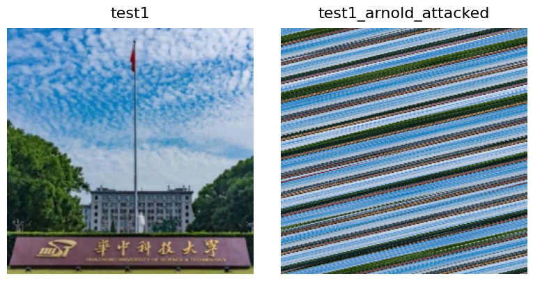
​    


    


---
## Logistic 算法

### Logistic: 初始化


```python
# Logistic: 初始化
logistic_key = (3.6, 0.6, 3)
logistic = LogisticCrypto(logistic_key)
```

### Logistic: 图像加密


```python
# Logistic KM: 图像加密
test1_logistic_encrypted = logistic.encrypt(img1)
test2_logistic_encrypted = logistic.encrypt(img2)
```


      0%|          | 0/3 [00:00<?, ?it/s]


    Encrypt time: 0.23s


      0%|          | 0/3 [00:00<?, ?it/s]


    Encrypt time: 0.94s


### Logistic: 图像解密 (正确)


```python
# Logistic: 图像解密 (密钥正确时)
test1_logistic_decrypted = logistic.decrypt(test1_logistic_encrypted, logistic_key)
test2_logistic_decrypted = logistic.decrypt(test2_logistic_encrypted, logistic_key)
```


      0%|          | 0/3 [00:00<?, ?it/s]


    Decrypt time: 0.25s


      0%|          | 0/3 [00:00<?, ?it/s]


    Decrypt time: 1.00s


```python
imshow(img1, test1_logistic_encrypted, test1_logistic_decrypted, titles=["test1", "test1_logistic_encrypted", "test1_logistic_decrypted"])
imshow(img2, test2_logistic_encrypted, test2_logistic_decrypted, titles=["test2", "test2_logistic_encrypted", "test2_logistic_decrypted"])
```


​    

​    


    


### Logistic: 图像解密 (错误)


```python
# Logistic: 图像解密 (密钥错误时)
logistic_key_wrong = (3.6, 0.5, 3)  # 错误密钥，正确密钥应为 (3.6, 0.6, 3)
test1_logistic_decrypted_wrong = logistic.decrypt(test1_logistic_encrypted, logistic_key_wrong)
test2_logistic_decrypted_wrong = logistic.decrypt(test2_logistic_encrypted, logistic_key_wrong)
```


      0%|          | 0/3 [00:00<?, ?it/s]


    Decrypt time: 0.30s


      0%|          | 0/3 [00:00<?, ?it/s]


    Decrypt time: 0.98s


```python
imshow(img1, test1_logistic_encrypted, test1_logistic_decrypted_wrong, titles=["test1", "test1_logistic_encrypted", "test1_logistic_decrypted_wrong"])
imshow(img2, test2_logistic_encrypted, test2_logistic_decrypted_wrong, titles=["test2", "test2_logistic_encrypted", "test2_logistic_decrypted_wrong"])
```


​    

​    


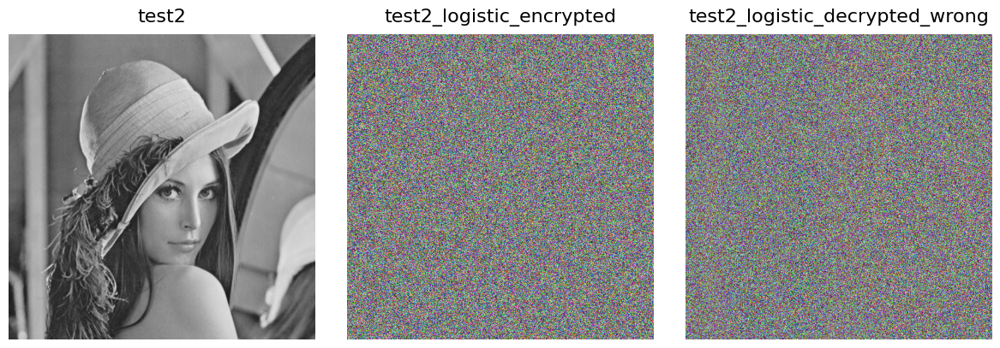
    


### Logistic: 评价指标

#### Intensity Histogram


```python
# 测试图1 使用 Logistic 加密前后的 Intensity Histogram
draw_intensity_histogram(img1, test1_logistic_encrypted)
# 测试图2 使用 Logistic 加密前后的 Intensity Histogram
draw_intensity_histogram(img2, test2_logistic_encrypted, is_gray=True)
```


​    

​    


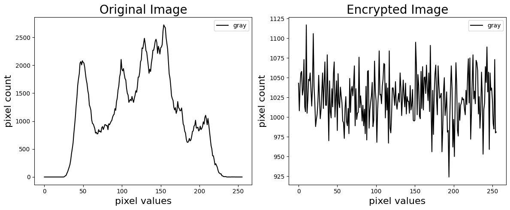
    


#### Adjacent Pixel Auto-Correlation


```python
# 测试图1 使用 Logistic KM 加密前后的 Adjacent Pixel Auto-Correlation
draw_adjacent_pixel_auto_correlation(img1, test1_logistic_encrypted)
# 测试图2 使用 Logistic KM 加密前后的 Adjacent Pixel Auto-Correlation
draw_adjacent_pixel_auto_correlation(img2, test2_logistic_encrypted)
```


​    
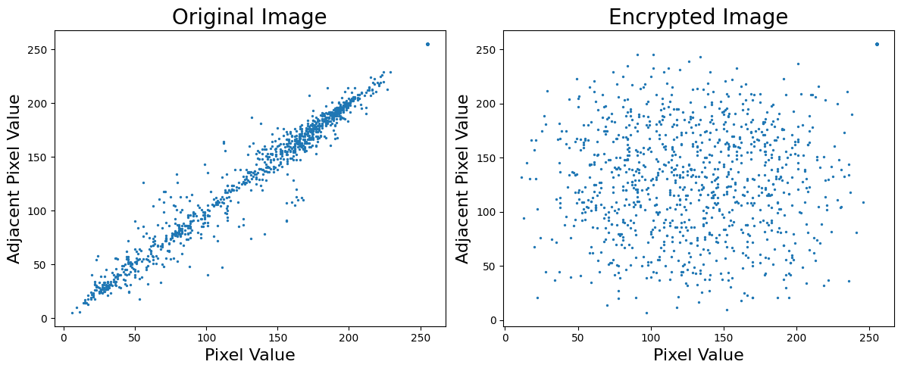
​    


    


#### 抗攻击能力


```python
# 使用与正确密钥极为相近的错误密钥尝试解密，模拟攻击过程
logistic_key_attacked = (3.6, 0.6, 2)  # 攻击密钥，正确密钥应为 (3.6, 0.6, 3)
test1_logistic_attacked = logistic.decrypt(test1_logistic_encrypted, logistic_key_attacked)
test2_logistic_attacked = logistic.decrypt(test2_logistic_encrypted, logistic_key_attacked)
```


      0%|          | 0/2 [00:00<?, ?it/s]


    Decrypt time: 0.20s


      0%|          | 0/2 [00:00<?, ?it/s]


    Decrypt time: 0.73s


```python
imshow(img1, test1_logistic_attacked, titles=["test1", "test1_logistic_attacked"])
imshow(img2, test2_logistic_attacked, titles=["test2", "test2_logistic_attacked"])
```


​    

​    


    


---
## Logistic with Key Mixing (Logistic KM) 算法

该算法在 Logistic 算法的基础上加入了 Key Mixing 操作，即加解密过程对密钥进行动态更新；

在确保运行时间较短的同时，有效地提高了算法的安全性和密钥敏感性，为本次课程设计“图像安全”一节的**最佳实践**

### Logistic KM: 初始化


```python
# Logistic KM: 初始化
logistic_km_key = "ILoveHUST"
logistic_km = LogisticKeyMixingCrypto(logistic_km_key)
```

### Logistic KM: 图像加密


```python
# Logistic KM: 图像加密
test1_logistic_km_encrypted = logistic_km.encrypt(img1)
test2_logistic_km_encrypted = logistic_km.encrypt(img2)
```


      0%|          | 0/256 [00:00<?, ?it/s]


    Encryption time: 0.24s


      0%|          | 0/512 [00:00<?, ?it/s]


    Encryption time: 0.95s


### Logistic KM: 图像解密 (正确)


```python
# Logistic KM: 图像解密 (密钥正确时)
test1_logistic_km_decrypted = logistic_km.decrypt(test1_logistic_km_encrypted, logistic_km_key)
test2_logistic_km_decrypted = logistic_km.decrypt(test2_logistic_km_encrypted, logistic_km_key)
```


      0%|          | 0/256 [00:00<?, ?it/s]


    Decryption time: 0.26s


      0%|          | 0/512 [00:00<?, ?it/s]


    Decryption time: 1.00s


```python
imshow(img1, test1_logistic_km_encrypted, test1_logistic_km_decrypted, titles=["test1", "test1_logistic_km_encrypted", "test1_logistic_km_decrypted"])
imshow(img2, test2_logistic_km_encrypted, test2_logistic_km_decrypted, titles=["test2", "test2_logistic_km_encrypted", "test2_logistic_km_decrypted"])
```


​    

​    


    


### Logistic KM: 图像解密 (错误)


```python
# Logistic KM: 图像解密 (密钥错误时)
logistic_km_key_wrong = "ILoveYOU"    # 错误密钥，正确密钥应为 hust_secret
test1_logistic_km_decrypted_wrong = logistic_km.decrypt(test1_logistic_km_encrypted, logistic_km_key_wrong)
test2_logistic_km_decrypted_wrong = logistic_km.decrypt(test2_logistic_km_encrypted, logistic_km_key_wrong)
```


      0%|          | 0/256 [00:00<?, ?it/s]


    Decryption time: 0.25s


      0%|          | 0/512 [00:00<?, ?it/s]


    Decryption time: 1.00s


```python
imshow(img1, test1_logistic_km_encrypted, test1_logistic_km_decrypted_wrong, titles=["test1", "test1_logistic_km_encrypted", "test1_logistic_km_decrypted_wrong"])
imshow(img2, test2_logistic_km_encrypted, test2_logistic_km_decrypted_wrong, titles=["test2", "test2_logistic_km_encrypted", "test2_logistic_km_decrypted_wrong"])
```


​    
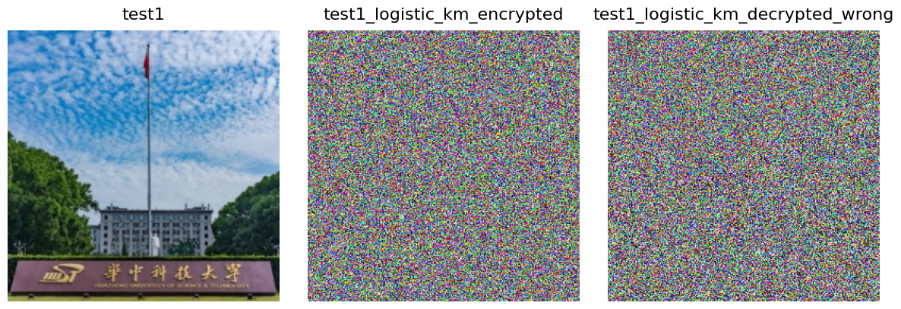
​    


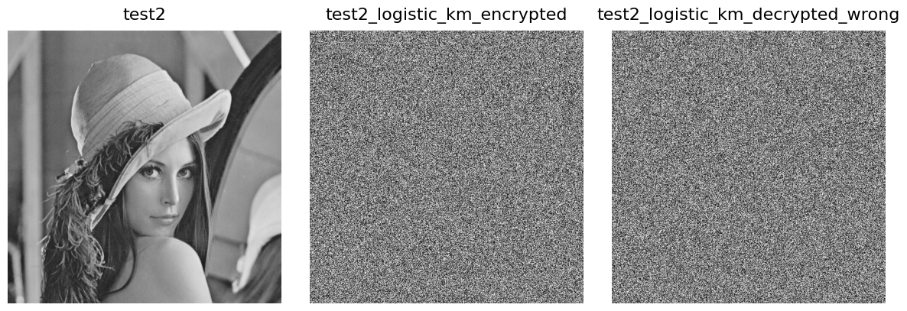
    


### Logistic KM: 评价指标

#### Intensity Histogram


```python
# 测试图1 使用 Logistic KM 加密前后的 Intensity Histogram
draw_intensity_histogram(img1, test1_logistic_km_encrypted)
# 测试图2 使用 Logistic KM 加密前后的 Intensity Histogram
draw_intensity_histogram(img2, test2_logistic_km_encrypted, is_gray=True)
```


​    
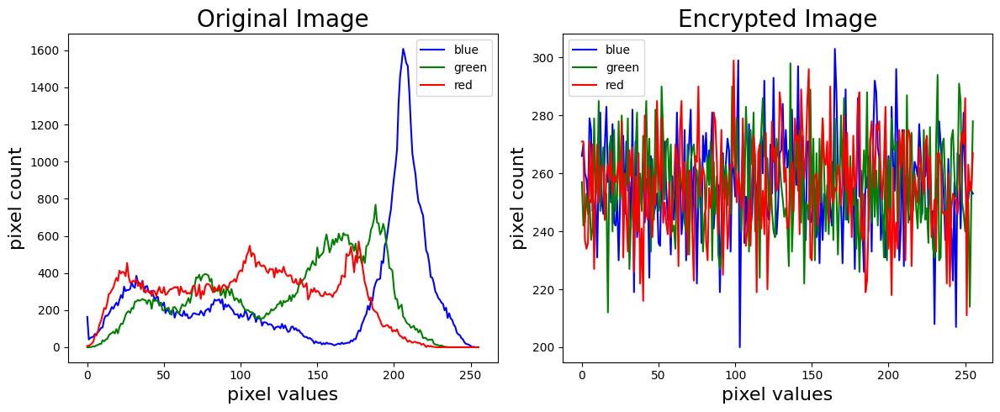
​    


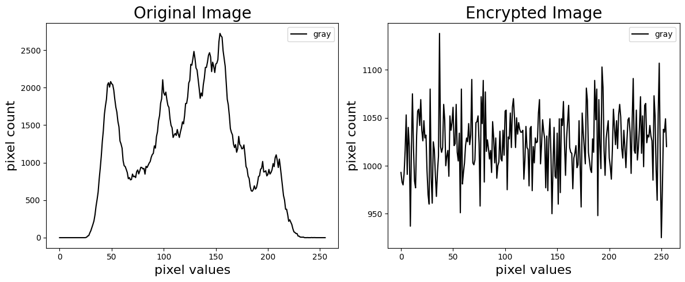
    


#### Adjacent Pixel Auto-Correlation


```python
# 测试图1 使用 Logistic KM 加密前后的 Adjacent Pixel Auto-Correlation
draw_adjacent_pixel_auto_correlation(img1, test1_logistic_km_encrypted)
# 测试图2 使用 Logistic KM 加密前后的 Adjacent Pixel Auto-Correlation
draw_adjacent_pixel_auto_correlation(img2, test2_logistic_km_encrypted)
```


​    
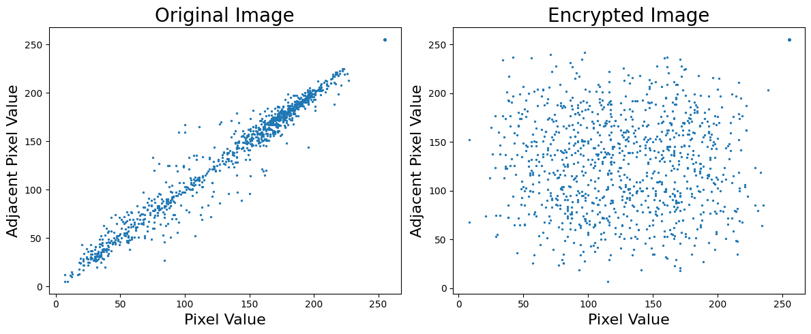
​    


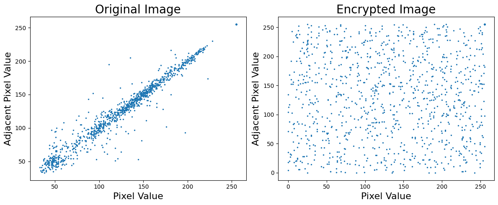
    


#### 抗攻击能力


```python
# 使用与正确密钥极为相近的错误密钥尝试解密，模拟攻击过程
logistic_km_key_attacked = "ILoveHKUST"  # 攻击密钥，正确密钥应为 ILoveHUST
test1_logistic_km_attacked = logistic_km.decrypt(test1_logistic_km_encrypted, logistic_km_key_attacked)
test2_logistic_km_attacked = logistic_km.decrypt(test2_logistic_km_encrypted, logistic_km_key_attacked)
```


      0%|          | 0/256 [00:00<?, ?it/s]


    Decryption time: 0.27s


      0%|          | 0/512 [00:00<?, ?it/s]


    Decryption time: 1.00s


```python
imshow(img1, test1_logistic_km_attacked, titles=["test1", "test1_logistic_km_attacked"])
imshow(img2, test2_logistic_km_attacked, titles=["test2", "test2_logistic_km_attacked"])
```


​    

​    


